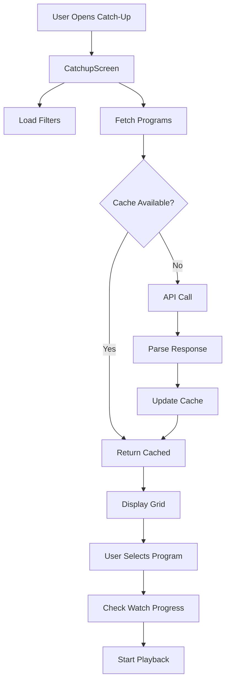
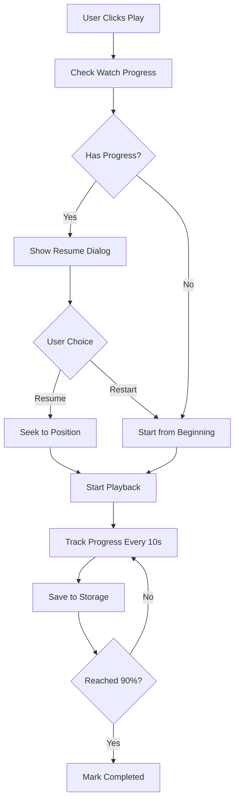

# Catch-Up TV Feature Design

**Date:** 2026-02-12  
**Feature:** Catch-Up TV (Replay TV / TV a la Carta)  
**Target Platforms:** Android, iOS, WebOS, Windows, Web

---

## Executive Summary

This document outlines the design for implementing a comprehensive Catch-Up TV feature in NeXtv IPTV. The feature enables users to watch previously aired programs through two complementary approaches:

1. **EPG Integration** - Direct access to past programs from the Electronic Program Guide
2. **Dedicated Section** - Browse and discover catch-up content with advanced filtering

The design prioritizes performance optimization for resource-constrained devices (WebOS TVs, mobile devices) while maintaining a premium user experience consistent with NeXtv's design language.

---

## User Requirements Summary

Based on brainstorming session:

- ✅ **Dual Access**: EPG integration + dedicated catch-up section
- ✅ **Time Window**: Provider-dependent availability (minimum 3 days guaranteed)
- ✅ **EPG UI**: Visual indicators + context menu for past programs
- ✅ **Organization**: Hybrid approach (channels + filters for category/date/search)
- ✅ **Features**: Favorites, "Watch Later" queue, viewing history
- ✅ **Playback**: Full VOD controls with automatic resume functionality
- ✅ **Performance**: Optimized for multi-platform with memory constraints

---

## Architecture

### Component Overview

```
lib/
├── core/
│   ├── models/
│   │   ├── catchup_program.dart          [NEW]
│   │   ├── catchup_item.dart             [NEW]
│   │   └── catchup_filter.dart           [NEW]
│   ├── services/
│   │   ├── catchup_service.dart          [NEW]
│   │   ├── catchup_storage_service.dart  [NEW]
│   │   └── catchup_playback_service.dart [NEW]
│   └── providers/
│       ├── catchup_provider.dart         [NEW]
│       ├── catchup_filters_provider.dart [NEW]
│       ├── watch_later_provider.dart     [NEW]
│       └── catchup_history_provider.dart [NEW]
├── presentation/
│   ├── screens/
│   │   └── catchup_screen.dart           [NEW]
│   └── widgets/
│       ├── catchup_program_card.dart     [NEW]
│       ├── catchup_timeline.dart         [NEW]
│       ├── catchup_filters_bar.dart      [NEW]
│       └── epg_catchup_indicator.dart    [NEW - modify EPG widgets]
```

---

## Data Models

### CatchupProgram

```dart
class CatchupProgram {
  final String id;
  final int channelId;
  final String channelName;
  final String channelLogo;
  final String title;
  final String description;
  final DateTime startTime;
  final DateTime endTime;
  final int durationSeconds;
  final String streamUrl;
  final String? thumbnailUrl;
  final String? category;
  
  // Computed properties
  Duration get duration => Duration(seconds: durationSeconds);
  bool get isExpired => DateTime.now().isAfter(expiryTime);
  DateTime get expiryTime; // Based on provider retention
  Duration get timeRemaining => expiryTime.difference(DateTime.now());
  
  // Factory from EPG
  factory CatchupProgram.fromEpgProgram(EpgProgram epg, String streamUrl);
  
  // JSON serialization
  Map<String, dynamic> toJson();
  factory CatchupProgram.fromJson(Map<String, dynamic> json);
}
```

### CatchupItem

```dart
class CatchupItem {
  final String programId;
  final DateTime addedAt;
  final int watchProgressSeconds;
  final bool completed;
  
  // Computed
  double get progressPercentage;
  
  // JSON serialization for SharedPreferences
  Map<String, dynamic> toJson();
  factory CatchupItem.fromJson(Map<String, dynamic> json);
}
```

### CatchupFilter

```dart
class CatchupFilter {
  final String? category;
  final int? channelId;
  final DateTimeRange? dateRange;
  final String? searchQuery;
  final CatchupSortOrder sortOrder;
  
  CatchupFilter copyWith({...});
}

enum CatchupSortOrder {
  newestFirst,
  oldestFirst,
  channelName,
  programName,
}
```

---

## Services Layer

### CatchupService

**Responsibilities:**
- Fetch catch-up programs from Xtream Codes API
- Query available retention period from provider
- Search and filter catch-up content
- Cache management with platform-specific limits

**Key Methods:**

```dart
class CatchupService {
  final XtreamApiService _apiService;
  final Map<String, List<CatchupProgram>> _cache = {};
  
  // Get available catch-up days from provider (min 3 days)
  Future<int> getAvailableDays() async;
  
  // Get catch-up programs for specific channel
  Future<List<CatchupProgram>> getCatchupForChannel(
    int channelId, 
    {int? days}
  ) async;
  
  // Get all catch-up programs with filters
  Future<List<CatchupProgram>> getCatchupPrograms({
    CatchupFilter? filter,
    int page = 0,
    int pageSize = 20,
  }) async;
  
  // Search catch-up content
  Future<List<CatchupProgram>> searchCatchup(String query) async;
  
  // Get catch-up stream URL
  Future<String> getCatchupStreamUrl(CatchupProgram program) async;
  
  // Cache management
  void _limitCache(); // Platform-specific limits
  void clearExpiredPrograms();
}
```

### CatchupStorageService

**Responsibilities:**
- Manage favorites, watch later queue, and history
- Persist data to SharedPreferences
- Enforce storage limits per platform

**Key Methods:**

```dart
class CatchupStorageService {
  final SharedPreferences _prefs;
  final StreamController<List<CatchupItem>> _favoritesController;
  final StreamController<List<CatchupItem>> _watchLaterController;
  final StreamController<List<CatchupItem>> _historyController;
  
  // Favorites
  Future<void> addToFavorites(CatchupProgram program);
  Future<void> removeFromFavorites(String programId);
  Stream<List<CatchupItem>> watchFavorites();
  bool isFavorite(String programId);
  
  // Watch Later Queue
  Future<void> addToWatchLater(CatchupProgram program);
  Future<void> removeFromWatchLater(String programId);
  Stream<List<CatchupItem>> watchWatchLater();
  
  // History
  Future<void> addToHistory(CatchupProgram program);
  Stream<List<CatchupItem>> watchHistory();
  Future<void> clearHistory();
  
  // Playback Progress
  Future<void> saveWatchProgress(String programId, int positionSeconds, int durationSeconds);
  Future<CatchupItem?> getWatchProgress(String programId);
  
  // Storage limits (platform-specific)
  static const int MAX_FAVORITES = 50;
  static const int MAX_WATCH_LATER = 30;
  static const int MAX_HISTORY = 50;
  
  void dispose();
}
```

### CatchupPlaybackService

**Responsibilities:**
- Handle playback state for catch-up content
- Auto-resume from saved position
- Track watch progress

**Key Methods:**

```dart
class CatchupPlaybackService {
  final CatchupStorageService _storageService;
  
  // Start playback with auto-resume
  Future<PlaybackInfo> startPlayback(CatchupProgram program) async;
  
  // Save progress periodically
  Future<void> updateProgress(String programId, Duration position, Duration duration);
  
  // Mark as completed
  Future<void> markCompleted(String programId);
}
```

---

## State Management (Riverpod)

### Providers

```dart
// Service providers
final catchupServiceProvider = Provider<CatchupService>((ref) {
  final apiService = ref.watch(xtreamApiServiceProvider);
  return CatchupService(apiService);
});

final catchupStorageServiceProvider = Provider<CatchupStorageService>((ref) {
  final prefs = ref.watch(sharedPreferencesProvider);
  return CatchupStorageService(prefs);
});

// Data providers
final catchupProgramsProvider = FutureProvider.family<List<CatchupProgram>, CatchupFilter?>(
  (ref, filter) async {
    final service = ref.watch(catchupServiceProvider);
    return service.getCatchupPrograms(filter: filter);
  },
);

final catchupForChannelProvider = FutureProvider.family<List<CatchupProgram>, int>(
  (ref, channelId) async {
    final service = ref.watch(catchupServiceProvider);
    return service.getCatchupForChannel(channelId);
  },
);

// Storage providers
final catchupFavoritesProvider = StreamProvider<List<CatchupItem>>((ref) {
  final storage = ref.watch(catchupStorageServiceProvider);
  return storage.watchFavorites();
});

final watchLaterProvider = StreamProvider<List<CatchupItem>>((ref) {
  final storage = ref.watch(catchupStorageServiceProvider);
  return storage.watchWatchLater();
});

final catchupHistoryProvider = StreamProvider<List<CatchupItem>>((ref) {
  final storage = ref.watch(catchupStorageServiceProvider);
  return storage.watchHistory();
});

// Filter state
final catchupFiltersProvider = StateProvider<CatchupFilter>((ref) {
  return CatchupFilter();
});

// Lookup providers
final isCatchupFavoriteProvider = Provider.family<bool, String>((ref, programId) {
  final favorites = ref.watch(catchupFavoritesProvider).value ?? [];
  return favorites.any((item) => item.programId == programId);
});
```

---

## UI Components

### 1. EPG Integration

#### EpgCatchupIndicator Widget

**Visual Design:**
- Past programs show a subtle replay icon (◀️ or ⟲)
- Dimmed appearance for expired programs
- Color: `NextvColors.accent` for available, gray for expired

**Interaction:**
- **Single tap/click**: Direct playback with auto-resume
- **Long press/right-click**: Context menu
  - "Watch Now"
  - "Add to Watch Later"
  - "Add to Favorites"
  - "Program Info"

```dart
class EpgCatchupIndicator extends ConsumerWidget {
  final EpgProgram program;
  
  @override
  Widget build(BuildContext context, WidgetRef ref) {
    final hasCatchup = _checkCatchupAvailability(program);
    
    if (!hasCatchup) return SizedBox.shrink();
    
    return GestureDetector(
      onTap: () => _playProgram(context, ref),
      onLongPress: () => _showContextMenu(context, ref),
      child: Icon(
        Icons.replay_circle_filled,
        color: program.isExpired 
          ? Colors.grey 
          : NextvColors.accent,
        size: 20,
      ),
    );
  }
}
```

### 2. Dedicated Catch-Up Screen

#### Layout Structure

```
┌─────────────────────────────────────────┐
│  Premium Top Bar (NeXtv Logo)           │
├─────────────────────────────────────────┤
│  Filters Bar                            │
│  [Category ▼] [Date ▼] [🔍 Search]     │
├─────────────────────────────────────────┤
│  Channel List (Left)  │  Programs Grid  │
│  ┌──────────────┐     │  ┌───┬───┬───┐ │
│  │ Channel 1    │     │  │ P │ P │ P │ │
│  │ Channel 2    │ ◄───┼─▶│ P │ P │ P │ │
│  │ Channel 3    │     │  │ P │ P │ P │ │
│  └──────────────┘     │  └───┴───┴───┘ │
└─────────────────────────────────────────┘
```

#### CatchupFiltersBar Widget

```dart
class CatchupFiltersBar extends ConsumerWidget {
  @override
  Widget build(BuildContext context, WidgetRef ref) {
    final filter = ref.watch(catchupFiltersProvider);
    
    return Container(
      padding: EdgeInsets.all(16),
      child: Row(
        children: [
          // Category dropdown
          CategoryDropdown(
            value: filter.category,
            onChanged: (cat) => _updateFilter(ref, category: cat),
          ),
          SizedBox(width: 16),
          
          // Date range picker
          DateRangeButton(
            range: filter.dateRange,
            onChanged: (range) => _updateFilter(ref, dateRange: range),
          ),
          SizedBox(width: 16),
          
          // Search field
          Expanded(
            child: SearchField(
              onSearch: (query) => _updateFilter(ref, searchQuery: query),
            ),
          ),
        ],
      ),
    );
  }
}
```

#### CatchupProgramCard Widget

```dart
class CatchupProgramCard extends ConsumerWidget {
  final CatchupProgram program;
  
  @override
  Widget build(BuildContext context, WidgetRef ref) {
    final isFavorite = ref.watch(isCatchupFavoriteProvider(program.id));
    final watchProgress = ref.watch(watchProgressProvider(program.id));
    
    return Card(
      child: Column(
        crossAxisAlignment: CrossAxisAlignment.start,
        children: [
          // Thumbnail with progress indicator
          Stack(
            children: [
              CachedNetworkImage(
                imageUrl: program.thumbnailUrl ?? program.channelLogo,
                height: 120,
                width: double.infinity,
                fit: BoxFit.cover,
              ),
              if (watchProgress != null)
                Positioned(
                  bottom: 0,
                  left: 0,
                  right: 0,
                  child: LinearProgressIndicator(
                    value: watchProgress.progressPercentage,
                    backgroundColor: Colors.grey.withOpacity(0.3),
                    valueColor: AlwaysStoppedAnimation(NextvColors.accent),
                  ),
                ),
              // Expiry badge
              if (program.timeRemaining.inHours < 24)
                Positioned(
                  top: 8,
                  right: 8,
                  child: ExpiryBadge(timeRemaining: program.timeRemaining),
                ),
            ],
          ),
          
          // Program info
          Padding(
            padding: EdgeInsets.all(12),
            child: Column(
              crossAxisAlignment: CrossAxisAlignment.start,
              children: [
                Text(
                  program.title,
                  style: TextStyle(
                    fontWeight: FontWeight.bold,
                    fontSize: 14,
                  ),
                  maxLines: 2,
                  overflow: TextOverflow.ellipsis,
                ),
                SizedBox(height: 4),
                Text(
                  '${program.channelName} • ${_formatDateTime(program.startTime)}',
                  style: TextStyle(
                    color: Colors.grey,
                    fontSize: 12,
                  ),
                ),
                SizedBox(height: 8),
                
                // Action buttons
                Row(
                  children: [
                    IconButton(
                      icon: Icon(
                        isFavorite ? Icons.star : Icons.star_border,
                        color: NextvColors.accent,
                      ),
                      onPressed: () => _toggleFavorite(ref),
                    ),
                    IconButton(
                      icon: Icon(Icons.watch_later_outlined),
                      onPressed: () => _addToWatchLater(ref),
                    ),
                    Spacer(),
                    ElevatedButton.icon(
                      icon: Icon(Icons.play_arrow),
                      label: Text(watchProgress != null ? 'Continue' : 'Play'),
                      onPressed: () => _playProgram(context, ref),
                    ),
                  ],
                ),
              ],
            ),
          ),
        ],
      ),
    );
  }
}
```

---

## Performance Optimizations

### Platform-Specific Configuration

```dart
class CatchupConfig {
  // Cache limits by platform
  static int getMaxCacheSize() {
    if (kIsWeb) return 50;
    if (Platform.isAndroid || Platform.isIOS) return 50;
    if (_isWebOS() || _isAndroidTV()) return 75;
    return 100; // Desktop
  }
  
  // Pagination size
  static int getPageSize() {
    if (_isWebOS()) return 15; // Smaller for WebOS
    if (Platform.isAndroid || Platform.isIOS) return 20;
    return 30; // Desktop/Web
  }
  
  // Image preloading
  static bool shouldPreloadThumbnails() {
    return !_isWebOS(); // WebOS: limited RAM
  }
  
  // Auto-cleanup interval
  static Duration getCleanupInterval() {
    return Duration(hours: 24);
  }
}
```

### Memory Management Strategies

1. **Lazy Loading**: Load thumbnails only when visible in viewport
2. **Pagination**: Load programs in batches (15-30 items)
3. **Cache Eviction**: LRU cache with platform-specific limits
4. **Shared Data**: Reuse EPG data models, don't duplicate
5. **Compression**: Store minimal JSON in SharedPreferences
6. **Auto-Cleanup**: Remove expired programs every 24h

### ListView Optimization

```dart
// Use ListView.builder with pagination
ListView.builder(
  itemCount: programs.length + (hasMore ? 1 : 0),
  itemBuilder: (context, index) {
    if (index == programs.length) {
      // Load more trigger
      _loadNextPage();
      return LoadingIndicator();
    }
    return CatchupProgramCard(program: programs[index]);
  },
);
```

---

## Data Flow

### Catch-Up Discovery Flow



### Playback with Auto-Resume Flow



---

## Error Handling

### Common Scenarios

1. **Provider doesn't support catch-up**
   - Display message: "Catch-up not available for this provider"
   - Hide catch-up section in navigation

2. **Program expired**
   - Show grayed-out card with "Expired" badge
   - Disable playback button

3. **Stream URL unavailable**
   - Show error toast: "This program is no longer available"
   - Remove from watch later/favorites

4. **Network error**
   - Show retry button
   - Cache last successful response

5. **Storage quota exceeded**
   - Auto-remove oldest items from history
   - Show warning when favorites/watch later is full

---

## Testing Strategy

### Unit Tests

```dart
// Test CatchupService
test('should fetch catch-up programs for channel', () async {
  final service = CatchupService(mockApiService);
  final programs = await service.getCatchupForChannel(123);
  expect(programs, isNotEmpty);
});

// Test CatchupStorageService
test('should add program to favorites', () async {
  final storage = CatchupStorageService(mockPrefs);
  await storage.addToFavorites(mockProgram);
  expect(storage.isFavorite(mockProgram.id), true);
});

// Test cache limits
test('should enforce platform-specific cache limits', () {
  final service = CatchupService(mockApiService);
  // Add 200 programs
  service._limitCache();
  expect(service._cache.length, lessThanOrEqualTo(CatchupConfig.getMaxCacheSize()));
});
```

### Widget Tests

```dart
testWidgets('CatchupProgramCard shows progress indicator', (tester) async {
  await tester.pumpWidget(
    ProviderScope(
      overrides: [
        watchProgressProvider(mockProgram.id).overrideWithValue(
          CatchupItem(programId: mockProgram.id, watchProgressSeconds: 300),
        ),
      ],
      child: MaterialApp(
        home: CatchupProgramCard(program: mockProgram),
      ),
    ),
  );
  
  expect(find.byType(LinearProgressIndicator), findsOneWidget);
});
```

### Integration Tests

- Test EPG → Catch-up playback flow
- Test filter combinations
- Test pagination and scrolling
- Test auto-resume functionality
- Test on WebOS emulator (memory constraints)

---

## Implementation Phases

### Phase 1: Foundation (Week 1)
- [ ] Create data models (`CatchupProgram`, `CatchupItem`, `CatchupFilter`)
- [ ] Implement `CatchupService` with API integration
- [ ] Implement `CatchupStorageService` with SharedPreferences
- [ ] Set up Riverpod providers
- [ ] Unit tests for services

### Phase 2: UI Components (Week 2)
- [ ] Create `CatchupScreen` with basic layout
- [ ] Implement `CatchupFiltersBar`
- [ ] Implement `CatchupProgramCard`
- [ ] Add pagination and lazy loading
- [ ] Widget tests

### Phase 3: EPG Integration (Week 3)
- [ ] Add `EpgCatchupIndicator` to EPG widgets
- [ ] Implement context menu for past programs
- [ ] Connect EPG to catch-up playback
- [ ] Integration tests

### Phase 4: Playback Features (Week 4)
- [ ] Implement `CatchupPlaybackService`
- [ ] Add auto-resume functionality
- [ ] Implement progress tracking
- [ ] Add resume dialog UI
- [ ] Test on all platforms

### Phase 5: Polish & Optimization (Week 5)
- [ ] Platform-specific optimizations
- [ ] Memory profiling on WebOS
- [ ] Performance testing with 1000+ programs
- [ ] Error handling refinement
- [ ] Documentation updates

---

## Verification Plan

### Automated Tests
- Run full test suite: `flutter test`
- Widget tests for all new components
- Integration tests for critical flows

### Manual Testing Checklist

**Android:**
- [ ] Catch-up screen loads and displays programs
- [ ] Filters work correctly
- [ ] Playback with auto-resume
- [ ] Favorites/watch later persistence
- [ ] Memory usage acceptable (< 200MB)

**iOS:**
- [ ] Same as Android
- [ ] Smooth scrolling with 1000+ items

**WebOS:**
- [ ] Reduced cache size working
- [ ] No memory crashes with large lists
- [ ] Thumbnails load efficiently
- [ ] Remote control navigation

**Web:**
- [ ] Responsive layout
- [ ] Keyboard shortcuts
- [ ] Browser back button handling

**Windows:**
- [ ] Desktop layout optimized
- [ ] Mouse + keyboard interaction

### Performance Benchmarks
- Initial load time: < 2s
- Filter application: < 500ms
- Scroll performance: 60fps
- Memory usage (WebOS): < 150MB
- Memory usage (Mobile): < 200MB

---

## Future Enhancements

**Phase 2 Features** (Post-MVP):
- Download for offline viewing (mobile only)
- Parental controls for catch-up content
- Recommendations based on watch history
- Share program links
- Picture-in-picture mode
- Chromecast support

---

## Appendix: Xtream Codes API Reference

### Catch-Up Endpoints

```
GET /player_api.php?username={user}&password={pass}&action=get_simple_data_table&stream_id={id}

Response:
{
  "epg_listings": [
    {
      "id": "123",
      "title": "Program Title",
      "start": "2026-02-10 20:00:00",
      "end": "2026-02-10 21:00:00",
      "description": "...",
      "has_archive": 1
    }
  ]
}

Catch-up stream URL format:
http://{server}/streaming/timeshift.php?username={user}&password={pass}&stream={id}&start={timestamp}&duration={seconds}
```

---

## Conclusion

This design provides a comprehensive, performant catch-up TV solution that:
- ✅ Integrates seamlessly with existing EPG
- ✅ Offers dedicated discovery interface
- ✅ Optimizes for resource-constrained devices
- ✅ Maintains NeXtv's premium UX standards
- ✅ Follows clean architecture principles
- ✅ Supports all target platforms

**Recommended Agent for Implementation:** Sonnet 4.5 (optimal balance of capability and token efficiency)

**Estimated Implementation Time:** 5 weeks (phased approach)
